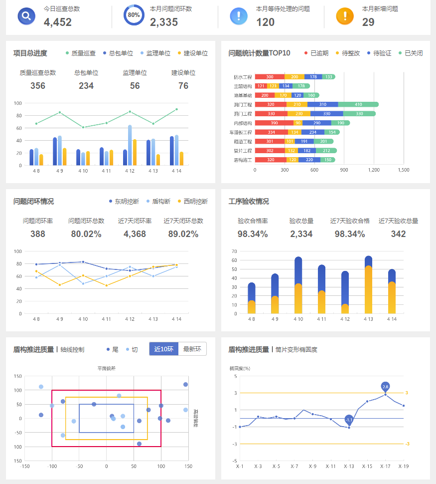

# interview-echarts

> 2018.08.21

## 确认需求

- 高度还原设计稿
- 反馈静态文件 ( html )

## 技术栈

- [x] echarts
- [x] requireJS
- [ ] x-template
- [ ] mork
- [x] less
- [ ] vue
- [ ] media

## TODO

1. `icon` 图片裁剪有问题
2. 自适应布局
3. 添加注释

## 预览

